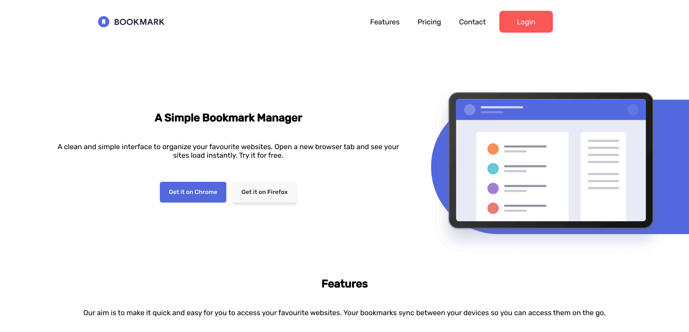
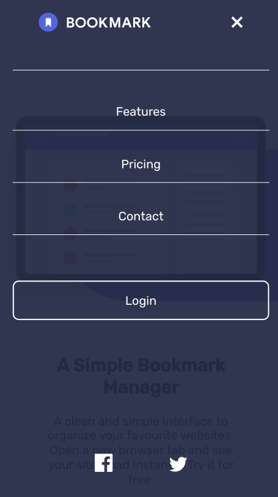

# Frontend Mentor - Bookmark landing page solution

This is a solution to the [Bookmark landing page challenge on Frontend Mentor](https://www.frontendmentor.io/challenges/bookmark-landing-page-5d0b588a9edda32581d29158). Frontend Mentor challenges help you improve your coding skills by building realistic projects.

## Table of contents

- [Overview](#overview)
  - [The challenge](#the-challenge)
  - [Screenshot](#screenshot)
  - [Links](#links)
- [My process](#my-process)
  - [Built with](#built-with)
  - [What I learned](#what-i-learned)
  - [Continued development](#continued-development)
  - [Useful resources](#useful-resources)

## Overview

### The challenge

Users should be able to:

- View the optimal layout for the site depending on their device's screen size
- See hover states for all interactive elements on the page
- Receive an error message when the newsletter form is submitted if:
  - The input field is empty
  - The email address is not formatted correctly

### Screenshot

### Links

- Live Site URL: [Github Pages](https://jdegand.github.io/bookmark-landing-page)

## My process

### Built with

- CSS custom properties
- Flexbox
- Grid
- Mobile-first workflow

### What I learned

### Continued development

- Better Semantics.
- Web Accessibility.
- Using row-reverse could be avoided by showing and hiding duplicate html content. When refreshing, you can see the content moving.  
- Putting 'position: relative' on the first-section::before prevents the hamburger from working.
- Using ::before for the background image with absolute positioning means *all* viewport sizes must be accounted for.
- Made the mobile nav fixed.  

### Useful resources

- [Stack Overflow](https://stackoverflow.com/questions/4476526/do-i-use-img-object-or-embed-for-svg-files) - Embedding SVGs
- [W3](https://www.w3.org/WAI/tutorials/page-structure/headings/) - Heading hierarchy
- [W3 schools](https://www.w3schools.com/cssref/css3_pr_border-image.asp) - Border image
- [Stack Overflow](https://stackoverflow.com/questions/10164393/use-border-image-only-for-bottom-border-our-css-seems-to-replicate-the-image-ac) - Border image
- [CSS Tricks](https://css-tricks.com/understanding-border-image/) - Border image property
- [Geeks for Geeks](https://www.geeksforgeeks.org/resize-image-proportionally-with-css/) - Image resizing
- [Free Code Camp](https://www.freecodecamp.org/news/the-mistake-developers-make-when-coding-a-hamburger-menu-f46c7a3ff956/) - Hamburger Menu
- [Geeks for Geeks](https://www.geeksforgeeks.org/how-to-disable-scrolling-temporarily-using-javascript/) - Stop Scrolling
- [Codepen](https://codepen.io/Coding_Journey/pen/RwNgYmm) - FAQ Accordion
- [Codepen](https://codepen.io/webcrunchblog/pen/YOZQXP) - Tabs matched with ids and hrefs
- [MDN](https://developer.mozilla.org/en-US/docs/Learn/Forms/Form_validation) - Form Validation
- [Stack Overflow](https://stackoverflow.com/questions/22252472/how-to-change-the-color-of-an-svg-element) - Filter to change svg img tag
- [Codepen](https://codepen.io/sosuke/pen/Pjoqqp) - CSS filter generator
- [W3 Schools](https://www.w3schools.com/colors/colors_converter.asp) - Colors Converter
- [Geeks for Geeks](https://www.geeksforgeeks.org/how-to-disable-scrolling-temporarily-using-javascript/) - Stop Scrolling
